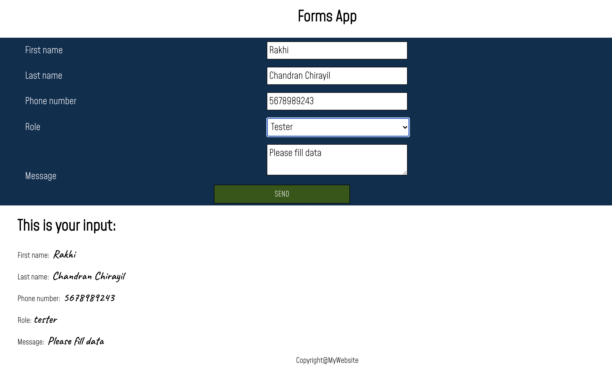
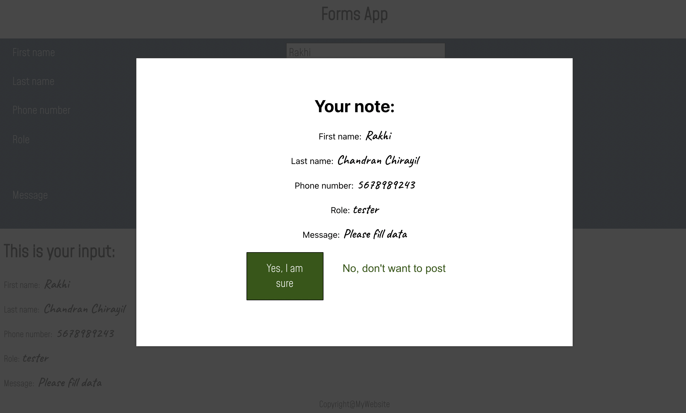
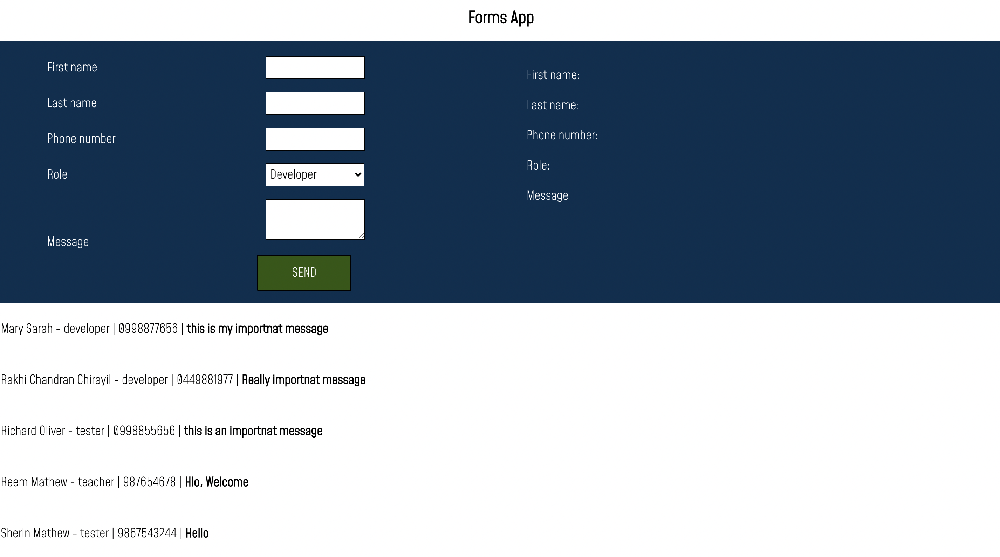

# React app to familiarise with forms and passing data and functions between components.

## created Form with input fields

- Firstname
- lastname
- Phonenumber
- Role
- Message

## Pop up functionality implemented using conditional rendering and css styles.

## Used json-server to get data from json file and post data to json file using axios

## screenshot

